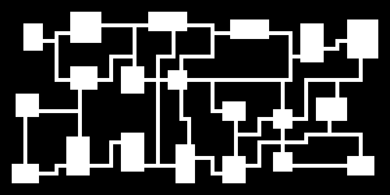
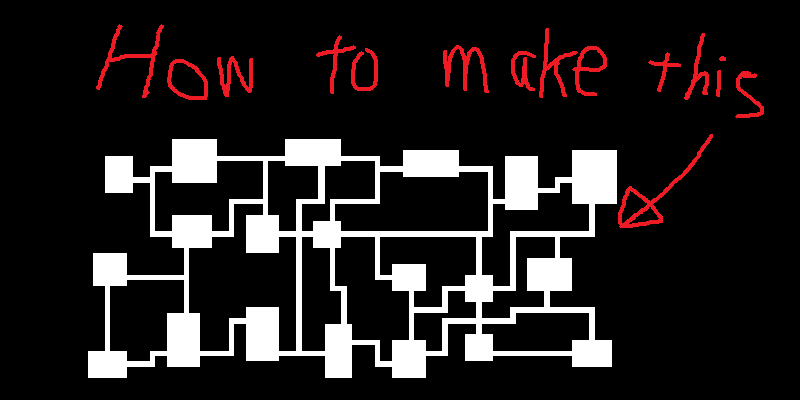
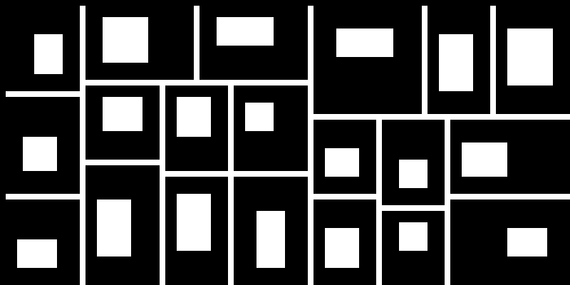
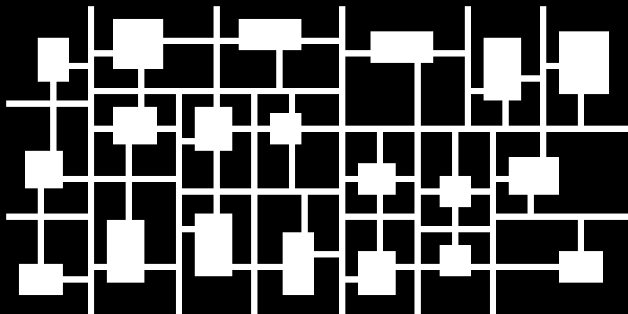
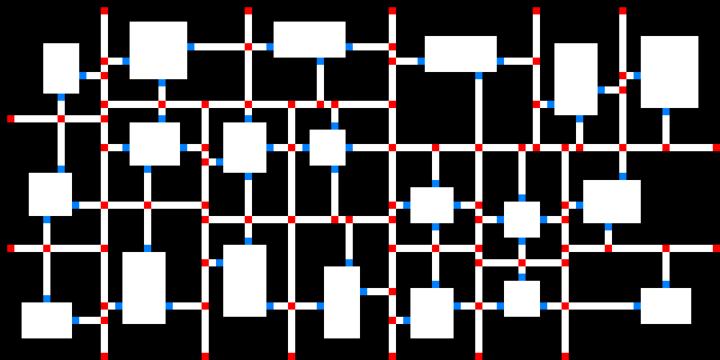
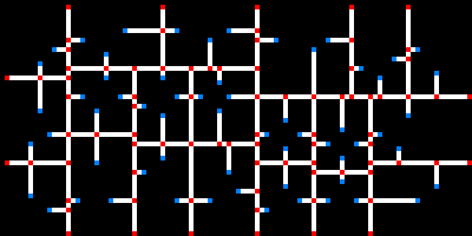
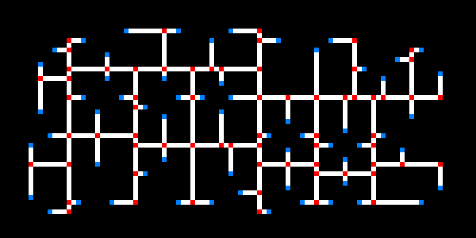
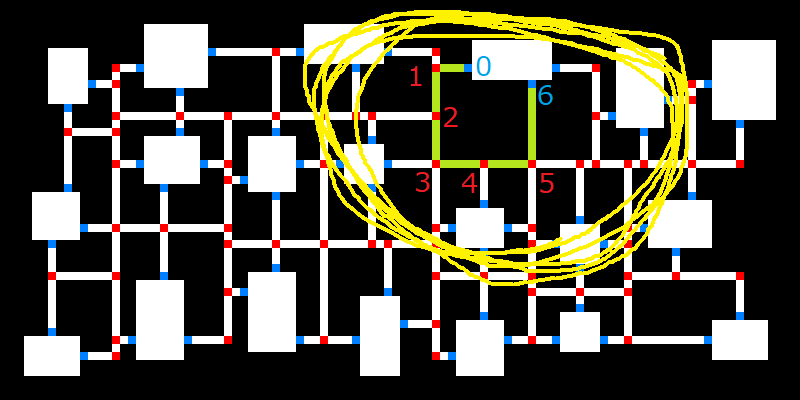
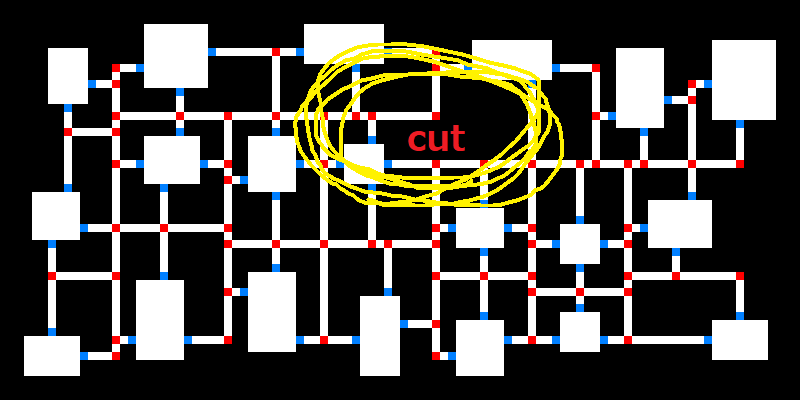
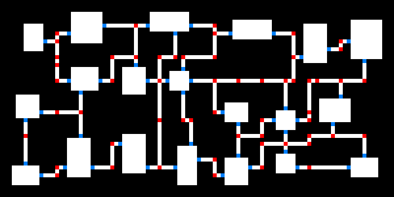

# Dungeon Map Generator

This program is a generator of the map inspired by Chocobo's Dungeon (PlayStation Game).

# Build

```sh
gcc --std=c99 -c dungeon.c -o dungeon.o
gcc --std=c99 -c main.c -o main.o
gcc --std=c99 dungeon.o main.o -o a.out
```

# Execution

```sh
./a.out 100 50 3 > a.pbm   # ./a.out <WIDTH_NUM> <HEIGHT_NUM> <RANDOM_SEED>
convert -resize 800% -filter point a.pbm a.png
```

`convert` is contained in ImageMagick.

# Result



# Library Usage

This repository is essentially a map-generator library.
Just one function, `init_board` is provided.
To see how to use the function, let's open `main.c`.

First, map style parameters are set.

```c:main.c
/* main() */
BOARD_PARAMETER parameter;
parameter.width           = atoi(argv[1]);
parameter.height          = atoi(argv[2]);
parameter.panel_size_min  = 12;
parameter.room_size_min   = 5;
parameter.room_size_max   = 10;
parameter.corridor_margin = 2;
parameter.wall_margin     = 1;
```

The declaration of the struct `BOARD_PARAMETER` is located in `dungeon.h`:

|name             |type |explanation                                                            |
|:----------------|:----|:----------------------------------------------------------------------|
|`width`          |`int`| Board width.                                                          |
|`height`         |`int`| Board height.                                                         |
|`panel_size_min` |`int`| This must be larger than  `room_size_min` + `corridor_margin*2` + `1`.|
|`room_size_min`  |`int`| The minimum length of the room edge.                                  |
|`room_size_max`  |`int`| The maximum length of the room edge.                                  |
|`corridor_margin`|`int`| The minimum length of the corridor directly connected to the room.    |
|`wall_margin`    |`int`| The minimum length of the corridor arrival point to the room corner.  |

The parameter is passed to the `init_board` function to creates the dungeon map.

```c:main.c
/* main() */
int *board = (int *) malloc(parameter.width * parameter.height * sizeof(int));
init_board(board, parameter);
```

The function prototype is located in the `dungeon.h`:

```c:dungeon.h
void init_board(int* board, const BOARD_PARAMETER parameter);
```

Then the dungeon map is obtained.
To know how to image the int type `board` array, please see the `print_board_pbm` function in `main.c`.

# Algorithm (digest version)



# Detail of the algorithm

### Dividing into panels

First, the board is divided into many panels in `init_board` function.
To divide, randomly choose a rectangle and draw a white line parallel to the shorter side.


These white lines are to be used as the corridor of the dungeon map.

Here is the definition of the elements of the `struct` type PANEL.

|name          |type    |explanation                       |
|:-------------|:-------|:---------------------------------|
|`r[2]`        |`int`   |location of the panel             |
|`size[2]`     |`int`   |size of the panel                 |
|`room_r[2]`   |`int`   |location of the room in the panel |
|`room_size[2]`|`int`   |size of the room in the panel     |
|`prev`        |`PANEL*`|previous element of the panel list|
|`next`        |`PANEL*`|next element of the panel list    |

Related functions:

```c:dungeon.c
static int divide_panel(
  const int p_index,
  int* p_used_index,
  PANEL* panel,
  const int panel_size_min,
  const int panel_index_max,
  const int corridor_margin
);
```

```c:dungeon.c
static int find_largest_panel(
  const int p_used_index,
  const PANEL* panel,
  const int panel_size_min
);
```

The variable `p_used_index` is the number of the elements in the PANEL list.

### Room

Each panel has one room.



Related functions:

```c:dungeon.c
static void register_room(
  const int p_used_index,
  PANEL* panel,
  const int room_size_min,
  const int room_size_max,
  const int corridor_margin
);
```

```c:dungeon.c
static void draw_room(
  BOARD* board,
  const int p_used_index,
  const PANEL* panel
);
```

### Connecting room to the long corridor

Inner rooms has 4 short path connecting the long corridor.
Side rooms have 3 short paths.
Corner rooms have 2 short paths.



Related functions:

```c:dungeon.c
void connect_room_corridor(int board[WIDTH][HEIGHT], const int p_used_index, const PANEL* panel);
```

### Cross points and end points

The cross points and end points are shown by red.
The points next to rooms are shown by blue.



Here is the definition of the elements of the `struct` type NODE.

|name     |type   |explanation                                               |
|:--------|:------|:---------------------------------------------------------|
|`type`   |`int`  |Red point:`NODE_CROSS`. Blue point:`p_index`              |
|`r[2]`   |`int`  |location of the nodes corresponding to the `board` indices|
|`edge[4]`|`NODE*`|right, left, up, down neighborhoods                       |
|`length` |`int`  |for BFS search                                            |
|`from`   |`NODE*`|for BFS search                                            |

Related function:

```c:dungeon.c
static int register_node(
  NODE* node,
  const BOARD* board
);
```

### Graph

The red and blue points are considered to be the nodes of the graph.
The edges of the graph are the paths in the corridor.



Related function:

```c:dungeon.c
static void connect_node(
  NODE* node,
  const int n_used_index,
  const BOARD* board
);
```

### Eliminating dead end

To eliminate dead end, the leaves of the graph are deleted.



This process is operated in the `main()` function.

```c:dungeon.c
/* main() */
for (int n_index=0; n_index<n_used_index; n_index++) {
  NODE *n = &(node[n_index]);
  if (n -> type == NODE_CROSS && count_edge(n) == 1) eliminate_node(n, board);
}
```

### Detecting a room-to-room path

Detect a closed loop which connects the same room by BFS algorithm.
The start and end point of the path is blue.
The inside points in the path should be red only.



Related function:

```c:dungeon.c
static NODE* get_loop_goal(
  const int n_gate_index,
  const int n_used_index,
  NODE* node,
  BOARD* board,
  const int node_index_max
);
```

### Cutting the loop

Randomly select an edge in the loop and cut it.



Related function:

```c:dungeon.c
static void eliminate_loop(
  NODE* goal,
  BOARD* board
);
```

### Cutting all loops

Repeat the present algorithm.
Finally, we obtain the corridor which has no room-to-room loops.



Related function:

```c:dungeon.c
static void eliminate_all_loop(const int p_used_index,
  const int n_used_index,
  NODE* node,
  BOARD* board,
  const int node_index_max
);
```

### Complete

We get the dungeon map, including T-junction.


